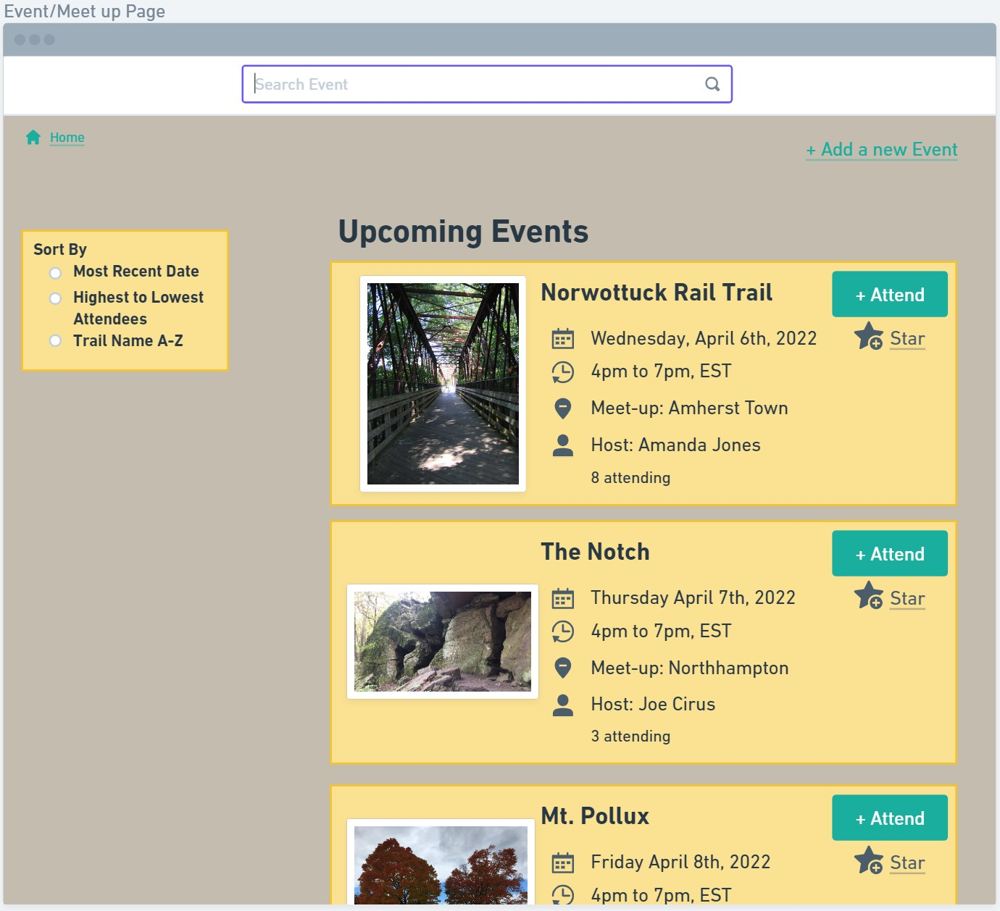
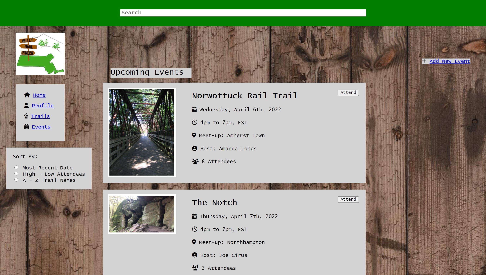
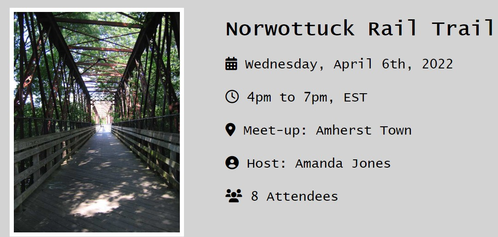
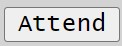
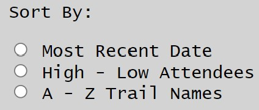
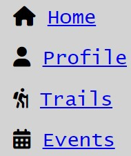

# Trail Page

The primary reason to visit this page will be able to see images of trails and a scrollable list reviews.

## Features and User Interaction:

---

- Search for other trail pages on our website.

  

---

- Gather information about cool landmarks and geography with some sort of icon system.

  

---

- "Add/Find Event": Find or create events associated with the page trail.
- "Directions": Get a link to google maps or some sort of gps sevice. Alternatively a link to a trail map.
- "Share": Get a link to this website page.

  

- More buttons may be added and the behavior of these may change.

---

- Sort reviews in various ways.

  

---

- Add a review! This form extends out when said button is clicked.

  

- We still need to add a way to input star rating.

---

- Like reviews.

  
  

---

# Trail Page Creation Page

  

The forms for features and activities may change to suit the needs of the website. For example radio buttons may work better than a text area.

---

# Event Page

## Wireframe
---

## HTML Page
---

## Features and User Interaction:
---
- Users create their own events by inputting based on trail name, time, meet-up location, host, and attendees

---
- There will be an 'attend' button for users to mark attendance for events created by other users

---
- There is a filter system where users can sort events by most recent date, high - low attendees, and by A-Z trail names

---
- Users can also search particular events

---
- The event page contains a small menu to navigate to other pages (e.g. Home, Profile, Trails, Events)

---

# Screenshot of home page:

This will be the main page for our Valley Trail Finder app. A general description of what the app is all about is given below the nav bar.

---
## Features:
---

Nav bar containing buttons which will link 

  -back to home

  -to the user profile page

  -the trails page

  -the events page
  
  ---

Another button which will link to the profile creation page

---

A button which will link to the section of the trail page associated with creation of new trails, which are not presently listed

---
# Initial wireframe: 

